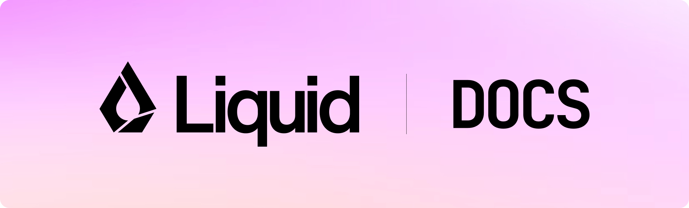

<div align="center">
  
  <div style="display: flex; justify-content: center; gap: 0.5em;">
    <a href="https://playground.liquid.ai/"><strong>Try LFM</strong></a> •
    <a href="https://docs.liquid.ai/lfm"><strong>Documentation</strong></a> •
    <a href="https://leap.liquid.ai/"><strong>LEAP</strong></a>
  </div>
  <br/>
  <a href="https://discord.com/invite/liquid-ai"></a>
</div>
</br>

This is the **official documentation repository** for Liquid AI. It contains comprehensive guides, API references, and tutorials for building with our open-weight [LFMs](https://huggingface.co/LiquidAI) and the [LEAP SDK](https://leap.liquid.ai/) on laptops, mobile, and edge devices. The documentation is hosted at [docs.liquid.ai](https://docs.liquid.ai).

## Table of Contents

- [Connect Liquid Docs to AI Coding Tools](#connect-liquid-docs-to-ai-coding-tools)
  - [What is MCP?](#what-is-mcp)
  - [Connect to Claude Code](#connect-to-claude-code)
  - [Connect to Cursor](#connect-to-cursor)
- [Contributing to the Documentation](#contributing-to-the-documentation)
  - [Prerequisites](#prerequisites)
  - [Install the Mintlify CLI](#install-the-mintlify-cli)
  - [Run the Documentation Locally](#run-the-documentation-locally)
  - [Making Changes](#making-changes)
  - [Submitting Changes](#submitting-changes)
  - [Link Check](#link-check)
- [License](#license)

---

## Connect Liquid Docs to AI Coding Tools

### What is MCP?

The Model Context Protocol (MCP) is an open standard that gives AI applications a standardized way to connect to external data sources and tools. By connecting your AI coding tool to Liquid docs via MCP, you're giving it live, queryable access to the complete documentation: not a snapshot, not a cached file, but a real-time search against your published content. Every time Liquid docs update, the MCP server reflects those changes automatically.

Liquid docs hosts an MCP server at:

```
https://docs.liquid.ai/mcp
```

---

### Connect to Claude Code

#### Step 1: Add the MCP server

Run the following command in your terminal:

```bash
claude mcp add --transport http liquid-docs https://docs.liquid.ai/mcp
```

This will automatically configure Claude Code to connect to the Liquid docs MCP server.

#### Step 2: Verify the connection

First, confirm the MCP server was added by listing all configured servers:

```bash
claude mcp list
```

You should see `liquid-docs` in the list of MCP servers.

Then, in a Claude Code session, ask a question about Liquid AI:

```
How do I deploy an LFM model to Android using the LEAP SDK?
```

Claude Code will query your MCP server and return an answer grounded in Liquid docs.

---

### Connect to Cursor

#### Option A: One-click install from Liquid docs (fastest)

1. Open any page on the Liquid docs site.
2. Click the contextual AI menu icon (✨) in the top-right corner of the page.
3. Select **Connect to Cursor**.
4. Cursor will open and prompt you to confirm. Click **Allow**.

Done - no manual configuration needed.

#### Option B: Manual setup via the Command Palette

**Step 1: Open the Command Palette**

Press `Cmd+Shift+P` on macOS or `Ctrl+Shift+P` on Windows.

**Step 2: Search for MCP Settings**

Type **Open MCP settings** and select it.

**Step 3: Add a custom MCP server**

Click **Add custom MCP**. This opens the `mcp.json` file.

**Step 4: Add the configuration**

Paste the following:

```json
{
  "mcpServers": {
    "liquid-docs": {
      "url": "https://docs.liquid.ai/mcp"
    }
  }
}
```

Save the file and restart Cursor.

**Step 5: Verify the connection**

Open a Cursor chat and ask something about Liquid AI. Cursor will query your MCP server and use Liquid docs as context when generating responses.

---

## Contributing to the Documentation

We welcome contributions to improve the Liquid AI documentation! Here's how to get started:

### Prerequisites

You'll need Node.js installed on your machine.

### Install the Mintlify CLI

Install Mintlify locally using npm:

```bash
npm i -g mintlify
```

### Run the Documentation Locally

Navigate to the docs directory and start the development server:

```bash
cd docs
mintlify dev
```

The documentation will be available at `http://localhost:3000` (or `http://localhost:3001` if port 3000 is already in use).

### Making Changes

1. Edit the `.mdx` or `.md` files in the `docs` directory
2. The dev server will automatically reload to reflect your changes
3. Follow the guidelines in [CLAUDE.md](./CLAUDE.md) for MDX syntax and styling conventions
4. Test your changes thoroughly before submitting a pull request

### Submitting Changes

1. Create a new branch for your changes
2. Make your edits following our documentation standards
3. Test locally using `mintlify dev`
4. Submit a pull request with a clear description of your changes

For more details on Mintlify setup and configuration, visit the [official Mintlify documentation](https://mintlify.com/docs/quickstart).

### Link Check

The [`check-docs.yaml`](.github/workflows/check-docs.yaml) workflow has a `check-link` job that examine markdown links. Customize the config in [`link-check.json`](./link-check.json). If a link cannot be accessed (e.g. Github private repo), add the URL pattern to the `ignorePatterns` array.

---

## License

This documentation is licensed under [Attribution-ShareAlike 4.0 International](./LICENSE).