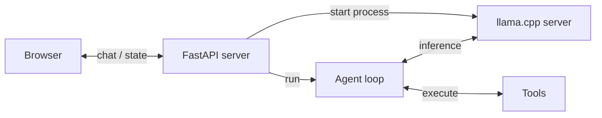
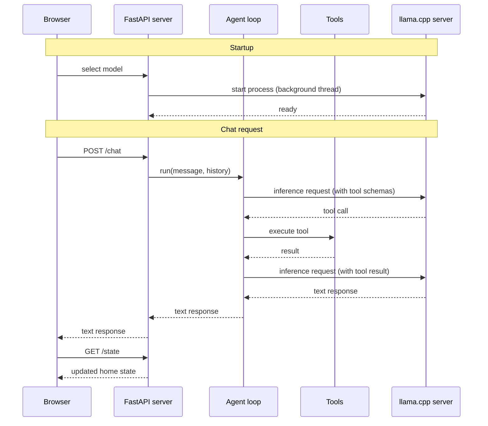
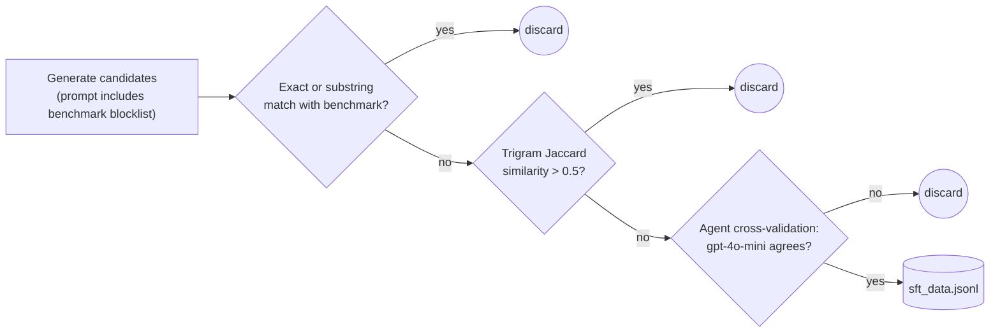
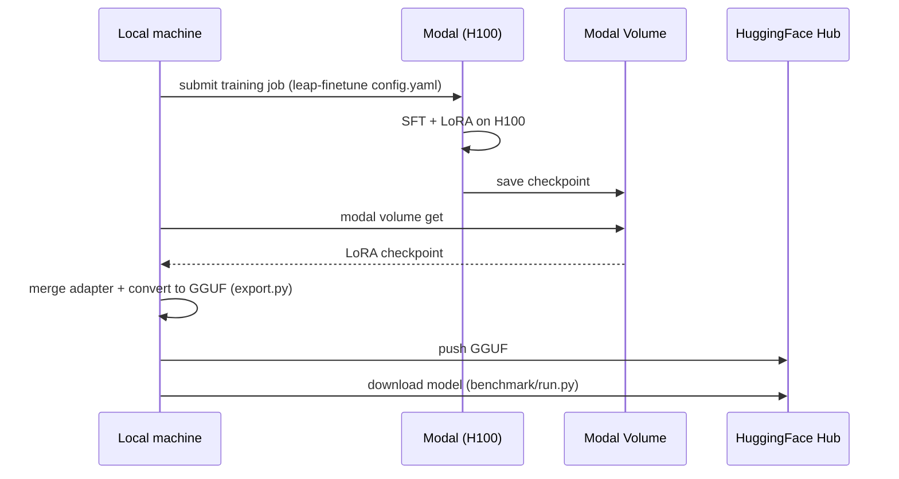

<Card title="View Source Code" icon="github" href="https://github.com/Liquid4All/cookbook/tree/main/examples/home-assistant">
  Browse the complete example on GitHub
</Card>

A step by step guide on building a home assistant system powered entirely by a local LFM model. Every stage of the journey is covered, from a first working prototype to a fine-tuned model for tool calling running fully on your own hardware.


## This is what you will learn

In this example, you will learn how to:

1. Build a proof of concept for a fully local Home Assistant.
2. Benchmark its tool-calling accuracy so you have a clear baseline to improve on.
3. Generate synthetic data for model fine-tuning.
4. Fine-tune the model on this synthetic data to maximise accuracy using serverless GPUs by Modal.
5. Deploy the fine-tuned model in the app.

## Quickstart

**Requirements**

- [uv](https://docs.astral.sh/uv/getting-started/installation/) for running the Python app
- [llama.cpp](https://github.com/ggerganov/llama.cpp?tab=readme-ov-file#installation) for running the model locally (`llama-server` must be on your PATH)

### 1. Clone the repository

```bash
git clone https://github.com/Liquid4All/cookbook.git
cd cookbook/examples/home-assistant
```

### 2. Start the app server

```bash
uv run uvicorn app.server:app --port 5173 --reload
```

### 3. Open the app

```bash
open http://localhost:5173
```

The UI includes a model selector. When you pick a model, the app automatically downloads and starts `llama-server` in the background. No manual model server setup is needed.

## Environment setup

You will need

- [uv](https://docs.astral.sh/uv/) to manage Python dependencies and run the application efficiently without creating virtual environments manually.
- [llama.cpp](https://github.com/ggerganov/llama.cpp) to run the LFM model locally. The `llama-server` binary must be on your PATH.
- [Modal](https://modal.com/) for GPU cloud compute when fine-tuning.
- [Weights & Biases](https://wandb.ai/) (optional) for experiment tracking during fine-tuning.

Let's go one by one.

### Install uv

<Accordion title="Click to see installation instructions for your platform">
  **macOS/Linux:**

  ```bash
  curl -LsSf https://astral.sh/uv/install.sh | sh
  ```

  **Windows:**

  ```
  powershell -ExecutionPolicy ByPass -c "irm https://astral.sh/uv/install.ps1 | iex"
  ```
</Accordion>

### Install llama.cpp

<Accordion title="Click to see installation instructions">
  Follow the [official installation guide](https://github.com/ggerganov/llama.cpp?tab=readme-ov-file#installation) for your platform.

  After installation, confirm `llama-server` is available on your PATH:

  ```bash
  llama-server --version
  ```
</Accordion>

### Modal setup

<Accordion title="Click to see installation instructions">
  1. Create an account at [modal.com](https://modal.com/)

  2. Install the Modal Python package inside your virtual environment:
     ```bash
     uv add modal
     ```

  3. Authenticate with Modal:
     ```bash
     uv run modal setup
     ```
</Accordion>

### Weights & Biases setup

<Accordion title="Click to see installation instructions">
  1. Create an account at [wandb.ai](https://wandb.ai/)
  2. Install the Weights & Biases Python package:
     ```bash
     uv add wandb
     ```
  3. Authenticate:
     ```bash
     uv run wandb login
     ```
</Accordion>

Once all tools are installed, sync the project dependencies:

```bash
uv sync
```

## Step 1: Build a proof of concept

The main components of the solution are:

- **Browser** renders the UI and sends chat messages to the server.
- **FastAPI server** handles HTTP requests, manages home state, and starts the llama.cpp server on model selection.
- **Agent loop** drives the conversation, calls the model for inference, and dispatches tool calls.
- **Tools** read and mutate the home state (lights, thermostat, doors, scenes).
- **llama.cpp server** runs the LFM model locally and exposes an OpenAI-compatible API.



The brain of the system is a small language model that maps English sentences to the right tool calls:

- `toggle_lights`: turn lights on or off in a specific room
- `set_thermostat`: change the temperature and operating mode
- `lock_door`: lock or unlock a door
- `get_device_status`: read the current state of any device
- `set_scene`: activate a preset that adjusts multiple devices at once
- `intent_unclear`: the most important tool for robustness. The model must call it whenever the request is ambiguous, off-topic, incomplete, or refers to an unsupported device. Getting this tool right is what separates a reliable assistant from one that hallucinates actions.

The sequence diagram below shows how the system starts and processes a chat message step by step:



## Step 2: Benchmark tool-calling accuracy

Play with the UI using one of the local models and you will quickly notice it sometimes works and sometimes it doesn't.


That is fine for a proof of concept. But the full power of small language models only comes out when you fine-tune them. Before you fine-tune, though, you need to know where you stand. You need to measure.

### Building a good benchmark

A good benchmark covers the space of possible inputs by systematic taxonomy, not intuition. The `benchmark/` directory contains a 100-task suite built around three dimensions:

| Dimension | Values |
|---|---|
| Capability | `lights`, `thermostat`, `doors`, `status`, `scene`, `rejection`, `multi_tool` |
| Phrasing | `imperative`, `colloquial`, `implicit`, `question` |
| Inference depth | `literal`, `semantic`, `boundary` |

The Cartesian product of those dimensions defines the universe of task types. At least one task is sampled per non-empty cell, forcing prompts you would not have thought of otherwise.

Every task has a pure Python verifier that inspects the final `home_state` dict or captured `tool_calls`. No LLM-as-judge. Deterministic, fast, cheap.

```python
# State check: was the right final state reached?
passed = state["lights"]["kitchen"]["state"] == "on"

# Tool-call check (for status queries and rejections)
call = _find_last_call(tool_calls, "intent_unclear")
passed = call is not None and call["args"].get("reason") == "off_topic"
```

### Running the benchmark

```bash
uv run python benchmark/run.py \
    --hf-repo LiquidAI/LFM2.5-1.2B-Instruct-GGUF \
    --hf-file LFM2.5-1.2B-Instruct-Q4_0.gguf
```

Run a single task by number (1-101):

```bash
uv run python benchmark/run.py \
    --hf-repo LiquidAI/LFM2.5-1.2B-Instruct-GGUF \
    --hf-file LFM2.5-1.2B-Instruct-Q4_0.gguf \
    --task 5
```

It is also worth running the benchmark against a frontier model like GPT-4o-mini to verify the agent harness is correct. If a state-of-the-art model does not pass almost everything, the problem is your code, not the model.

```bash
uv run python benchmark/run.py --backend openai
```

Results are printed to the console and saved as a Markdown file in `benchmark/results/`.

### Baseline results

| Model | Parameters | Score | Accuracy |
|---|---|---|---|
| gpt-4o-mini | n/a | 93/100 | 93% |
| LFM2.5-1.2B-Instruct Q4_0 | 1.2B | 71/100 | 71% |
| LFM2-350M Q8_0 | 350M | 28/100 | 28% |

These are not vibes anymore. These are actual numbers we can use to understand where we stand and how much room there is to improve.

## Step 3: Generate synthetic data

To fine-tune the model you need labelled training data. We generate it synthetically using a strong model like `gpt-4o-mini`. The pipeline has four stages to avoid contaminating the training dataset with examples too close to the benchmark:



1. **Blocklist in the prompt.** Every benchmark utterance is listed and the model is told not to reproduce them.
2. **Filter by exact or substring match.** Catches verbatim copies.
3. **Filter by trigram similarity.** Catches light paraphrases by measuring overlapping three-word chunks. Candidates with more than 50% overlap are discarded.
4. **Agent cross-validation.** Each surviving candidate is run through the real agent. Only examples where the agent produces the expected tool call are kept.

Generate 500 examples distributed across the benchmark taxonomy (requires `OPENAI_API_KEY` in `.env`):

```bash
uv run python benchmark/datasets/generate.py --count 500 --output benchmark/datasets/sft_data.jsonl
```

Then convert the dataset to the LFM2 text format and push it to HuggingFace so Modal can pull it during training:

```bash
uv run --group finetune python finetune/prepare_data.py \
    --input benchmark/datasets/sft_data.jsonl
```

## Step 4: Fine-tune the model

Fine-tuning adapts the base model to our specific task. We use LoRA (Low-Rank Adaptation), which injects a small set of trainable weight matrices on top of the frozen base model. This keeps GPU memory usage low and training fast while still producing meaningful accuracy gains.

Training runs on [Modal](https://modal.com) (a serverless GPU cloud) via [leap-finetune](https://github.com/Liquid4All/leap-finetune), Liquid AI's open source fine-tuning tool.



### Steps

**1. One-time setup.** Clone and install `leap-finetune`, then authenticate with HuggingFace and Modal.

```bash
git clone https://github.com/Liquid4All/leap-finetune
cd leap-finetune && uv sync && cd -
huggingface-cli login
modal setup
```

**2. Kick off training on Modal.** Runs 5 epochs of LoRA SFT on an H100. Takes a few minutes and costs roughly $1.50.

```bash
cd leap-finetune
uv run leap-finetune ../finetune/configs/LFM2-350M.yaml
```

**3. Download the checkpoint** from the Modal Volume once training finishes.

```bash
cd leap-finetune
uv run modal volume get leap-finetune /outputs/home-assistant-350M ../finetune/output/350M-lora
```

**4. Export.** Merges the LoRA adapter into the base model, converts to GGUF, and pushes to HuggingFace.

```bash
uv run --group export python finetune/export.py \
    --lora-path finetune/output/350M-lora \
    --output-path finetune/output/350M-merged \
    --push-to-hub \
    --quant-type q8_0
```

Re-run the benchmark with the flags printed by the export step:

```bash
uv run python benchmark/run.py \
    --hf-repo <your-hf-username>/home-assistant-LFM2-350M-GGUF \
    --hf-file LFM2-350M-q8_0.gguf
```

### Fine-tuned model results

Fine-tuning moved the score from **28 to 47 (+19 points)**. Here is the breakdown by capability:

| Capability | Baseline | Fine-tuned |
|---|---|---|
| lights | 25.0% | 87.5% |
| scene | 0.0% | 80.0% |
| doors | 56.2% | 56.2% |
| multi_tool | 8.3% | 33.3% |
| status | 0.0% | 30.0% |
| thermostat | 0.0% | 18.8% |
| rejection | 0.0% | 0.0% |

Rejection is the only category that did not improve. These tasks require the model to call `intent_unclear` instead of acting, which is harder than it sounds. Consider examples like "Dim the living room lights to 30%" (brightness not supported) or "Turn it on" (no target device specified). The training set had too few rejection examples. You can fix this by generating a rejection-heavy dataset and fine-tuning again:

```bash
uv run python benchmark/datasets/generate.py --count 500 \
    --capability-weights rejection=5
```

## Step 5: Deploy the fine-tuned model

The fine-tuned GGUF is already registered in `app/server.py` as `LFM2-350M fine-tuned Q8_0`.

**1. Start the server:**

```bash
uv run uvicorn app.server:app --port 5173 --reload
```

**2. Open the app:**

```bash
open http://localhost:5173
```

**3.** Select **LFM2-350M fine-tuned Q8_0** from the model dropdown. The app downloads the model from HuggingFace and starts `llama-server` automatically.

If you pushed your own fine-tuned model in Step 4, register it by adding an entry to `LOCAL_MODELS` in `app/server.py`:

```python
{
    "id": "my-ft-model",
    "name": "My fine-tuned model",
    "hf_repo": "<your-hf-username>/home-assistant-LFM2-350M-GGUF",
    "hf_file": "LFM2-350M-q8_0.gguf",
    "size_label": "~370 MB",
},
```

Restart the server and select your model from the dropdown.

## What's next?

In this example we showed how to go from a working prototype to a fine-tuned local assistant with measurable accuracy gains.

The model learned well across most capability areas. Lights went from 25% to 87.5%, on par with GPT-4o-mini. Scene went from 0% to 80%. The remaining gap is in rejection tasks, which is a data problem. Generate more rejection examples with `--capability-weights rejection=5` and fine-tune again to close that gap.

To improve results further you can:

- Increase the synthetic dataset size beyond 500 examples.
- Add more rejection examples using `--capability-weights rejection=5`.
- Extend the tool set and regenerate training data to cover new capabilities.

## Need help?

<CardGroup cols={1}>

<Card title="Join our Discord" icon="discord" iconType="brands" href="https://discord.gg/DFU3WQeaYD">
  Connect with the community and ask questions about this example.
</Card>

</CardGroup>
